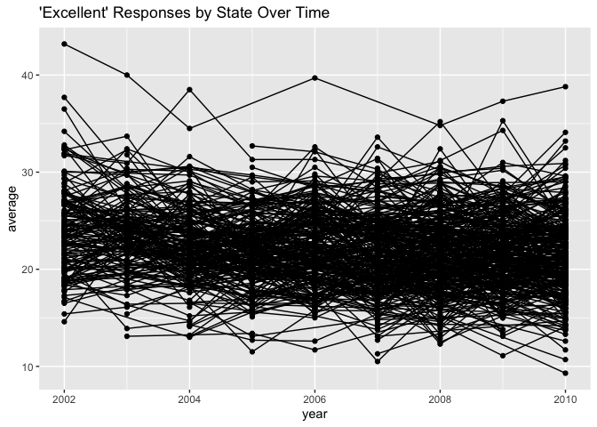
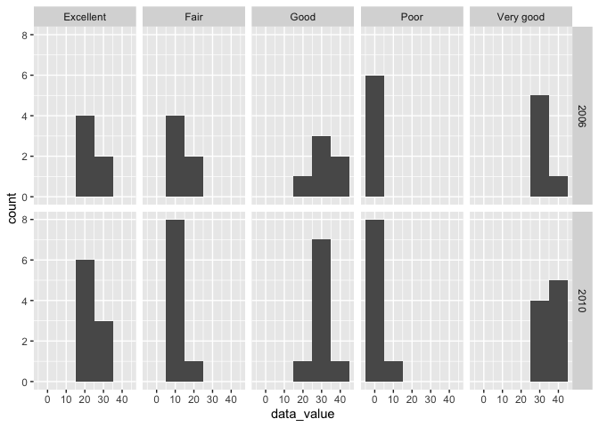
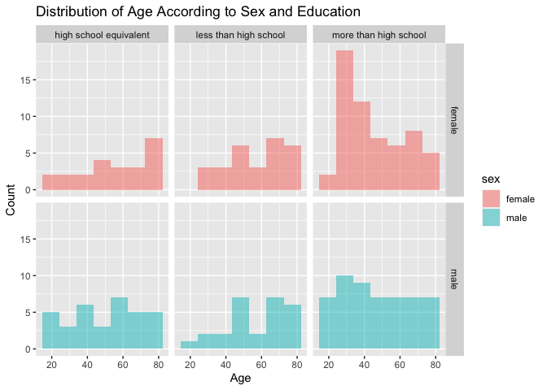
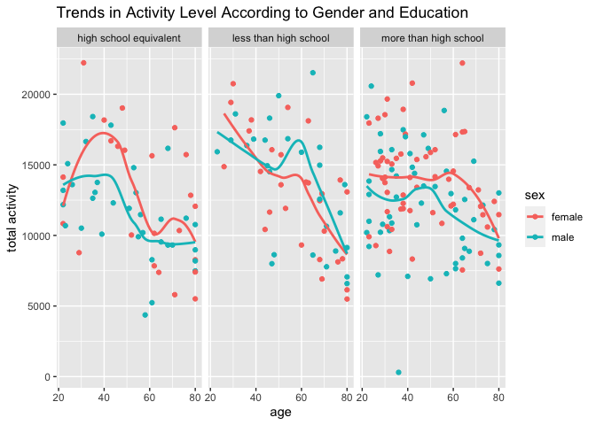
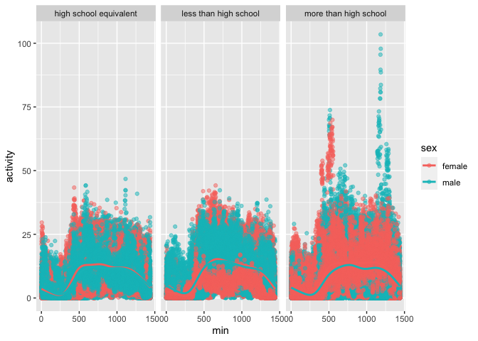

p8105_hw3_lel2176
================
2023-10-13

``` r
library(tidyverse)
```

    ## ── Attaching core tidyverse packages ──────────────────────── tidyverse 2.0.0 ──
    ## ✔ dplyr     1.1.3     ✔ readr     2.1.4
    ## ✔ forcats   1.0.0     ✔ stringr   1.5.0
    ## ✔ ggplot2   3.4.3     ✔ tibble    3.2.1
    ## ✔ lubridate 1.9.2     ✔ tidyr     1.3.0
    ## ✔ purrr     1.0.2     
    ## ── Conflicts ────────────────────────────────────────── tidyverse_conflicts() ──
    ## ✖ dplyr::filter() masks stats::filter()
    ## ✖ dplyr::lag()    masks stats::lag()
    ## ℹ Use the conflicted package (<http://conflicted.r-lib.org/>) to force all conflicts to become errors

``` r
library(p8105.datasets)
library(dplyr)
data("brfss_smart2010")
```

## Problem 2

#### tidy BRFSS data

``` r
BRFSS = 
brfss_smart2010 |> 
  select(Year, Locationabbr, Locationdesc, Class, Topic, Question, Response, Sample_Size, Data_value, Confidence_limit_Low, Confidence_limit_High, Display_order, GeoLocation) |> 
  rename(year = Year) |> 
  rename(state = Locationabbr) |> 
  rename(county = Locationdesc) |> 
  rename(class = Class) |> 
  rename(topic = Topic) |> 
  rename(question = Question) |> 
  rename(response = Response) |> 
  rename(sample_size = Sample_Size) |> 
  rename(data_value = Data_value) |> 
  rename(lower_confidence_lim = Confidence_limit_Low) |> 
  rename(upper_confidence_lim = Confidence_limit_High) |> 
  rename(display_order = Display_order) |> 
  rename(geolocation = GeoLocation)
```

#### sort tidy BRFSS data by general health responses

``` r
overall_health = BRFSS[BRFSS$topic=="Overall Health",]

sorted_overall_health = 
overall_health |> 
  mutate(overall_health = fct_relevel(overall_health$response, c("Poor", "Fair", "Good", "Very good", "Excellent"))) |> 
  arrange(overall_health)

sorted_overall_health
```

    ## # A tibble: 10,625 × 14
    ##     year state county       class topic question response sample_size data_value
    ##    <int> <chr> <chr>        <chr> <chr> <chr>    <chr>          <int>      <dbl>
    ##  1  2010 AL    AL - Jeffer… Heal… Over… How is … Poor              45        5.5
    ##  2  2010 AL    AL - Mobile… Heal… Over… How is … Poor              66        6.4
    ##  3  2010 AL    AL - Tuscal… Heal… Over… How is … Poor              35        4.2
    ##  4  2010 AZ    AZ - Marico… Heal… Over… How is … Poor              62        3.5
    ##  5  2010 AZ    AZ - Pima C… Heal… Over… How is … Poor              49        5.7
    ##  6  2010 AZ    AZ - Pinal … Heal… Over… How is … Poor              30        4  
    ##  7  2010 AR    AR - Benton… Heal… Over… How is … Poor              21        3  
    ##  8  2010 AR    AR - Pulask… Heal… Over… How is … Poor              36        3.8
    ##  9  2010 AR    AR - Washin… Heal… Over… How is … Poor              16        2.4
    ## 10  2010 CA    CA - Alamed… Heal… Over… How is … Poor              23        2.4
    ## # ℹ 10,615 more rows
    ## # ℹ 5 more variables: lower_confidence_lim <dbl>, upper_confidence_lim <dbl>,
    ## #   display_order <int>, geolocation <chr>, overall_health <fct>

#### analyze 2002 data

``` r
counties_2002 = 
  sorted_overall_health |> 
  filter(year == 2002) |> 
  group_by(state) |> 
  summarize(counties = length(unique(county))) |> 
  filter(counties >= 7)

counties_2002
```

    ## # A tibble: 6 × 2
    ##   state counties
    ##   <chr>    <int>
    ## 1 CT           7
    ## 2 FL           7
    ## 3 MA           8
    ## 4 NC           7
    ## 5 NJ           8
    ## 6 PA          10

#### analyze 2010 data

``` r
counties_2010 = 
  sorted_overall_health |> 
  filter(year == 2010) |> 
  group_by(state) |> 
  summarize(counties = length(unique(county))) |> 
  filter(counties >= 7)

counties_2010
```

    ## # A tibble: 14 × 2
    ##    state counties
    ##    <chr>    <int>
    ##  1 CA          12
    ##  2 CO           7
    ##  3 FL          41
    ##  4 MA           9
    ##  5 MD          12
    ##  6 NC          12
    ##  7 NE          10
    ##  8 NJ          19
    ##  9 NY           9
    ## 10 OH           8
    ## 11 PA           7
    ## 12 SC           7
    ## 13 TX          16
    ## 14 WA          10

States with 7 or more observed `Excellent` responses 2002: CT, FL, MA,
NJ, NC, PA

States with 7 or more observed `Excellent` responses 2010: CA, CO, FL,
MD, MA, NE, NJ, NY, NC, OH, PA, SC, TX, WA

#### analyze by excellent responses

``` r
excellent_data = 
  sorted_overall_health |> 
  filter(response == "Excellent") |> 
  group_by(year, county) |> 
  summarize(data_value_average = mean(data_value, na.rm = TRUE))
```

    ## `summarise()` has grouped output by 'year'. You can override using the
    ## `.groups` argument.

``` r
excellent_data
```

    ## # A tibble: 2,125 × 3
    ## # Groups:   year [9]
    ##     year county                      data_value_average
    ##    <int> <chr>                                    <dbl>
    ##  1  2002 AK - Anchorage Municipality               27.9
    ##  2  2002 AL - Jefferson County                     18.5
    ##  3  2002 AR - Pulaski County                       24.1
    ##  4  2002 AZ - Maricopa County                      21.6
    ##  5  2002 AZ - Pima County                          26.6
    ##  6  2002 CA - Los Angeles County                   22.7
    ##  7  2002 CO - Adams County                         21.2
    ##  8  2002 CO - Arapahoe County                      25.5
    ##  9  2002 CO - Denver County                        22.2
    ## 10  2002 CO - Jefferson County                     23.4
    ## # ℹ 2,115 more rows

``` r
ggplot(
  excellent_data, aes(x = year, y = data_value_average, group = county))+
  geom_point() +
  geom_line() +
  labs(
    title = "'Excellent' Responses by State Over Time", 
    x = "year", 
    y = "average"
  )
```

    ## Warning: Removed 6 rows containing missing values (`geom_point()`).

    ## Warning: Removed 5 rows containing missing values (`geom_line()`).

<!-- -->

this spaghetti plot shows the average number of `Excellent` responses to
a question about overall health throughout the years by each state. most
of the states follow similar trend lines with a few high and low
outliers. there appears to be an ever so slight decrease in `Excellent`
responses from 2002 to 2010.

#### compare 2006 and 2010 data

``` r
data_2006_2010 =
  sorted_overall_health |> 
  filter(state == "NY" & (year == "2006" | year == "2010")) |> 
  ggplot(aes(x = data_value)) +
  geom_histogram(binwidth = 10)  +
  facet_grid(year ~ response)

data_2006_2010
```

<!-- -->

this visualization of data shows the distribution of `data_value` for
the different responses for all of the different locations in New York
in both 2006 and 2010. it appears that in 2010, there are more observed
`Excellent`, `Fair`, `Good`, and `Poor` responses than in 2006. the
observations for `Very good` are about the same for 2006 and 2010.

## Probem 3

#### load data and clean

``` r
demographics = 
  read_csv("data/nhanes_covar.csv")[-c(1, 2, 3, 4),] 
```

    ## New names:
    ## Rows: 254 Columns: 5
    ## ── Column specification
    ## ──────────────────────────────────────────────────────── Delimiter: "," chr
    ## (5): ...1, 1 = male, ...3, ...4, 1 = Less than high school
    ## ℹ Use `spec()` to retrieve the full column specification for this data. ℹ
    ## Specify the column types or set `show_col_types = FALSE` to quiet this message.
    ## • `` -> `...1`
    ## • `` -> `...3`
    ## • `` -> `...4`

``` r
demographics = na.omit(demographics)

demographics = 
  demographics |> 
  rename(seqn = `...1`) |> 
  rename(sex = `1 = male`) |> 
  rename(age = `...3`) |> 
  rename(bmi = `...4`) |> 
  rename(education = `1 = Less than high school`) |> 
  mutate(
    sex = case_match(
      sex, 
      "1" ~ "male",
      "2" ~ "female"
    )
  ) |> 
  mutate(
    education = case_match(
      education, 
      "1" ~ "less than high school",
      "2" ~ "high school equivalent",
      "3" ~ "more than high school"
    )
  ) |> 
  mutate(seqn = as.numeric(seqn)) |> 
  mutate(sex = as.factor(sex)) |> 
  mutate(age = as.numeric(age)) |>  
  mutate(bmi = as.numeric(bmi)) |>  
  mutate(education = as.factor(education))

demographics = demographics[demographics$age > 21,]


accelerometer = read_csv("data/nhanes_accel.csv")
```

    ## Rows: 250 Columns: 1441
    ## ── Column specification ────────────────────────────────────────────────────────
    ## Delimiter: ","
    ## dbl (1441): SEQN, min1, min2, min3, min4, min5, min6, min7, min8, min9, min1...
    ## 
    ## ℹ Use `spec()` to retrieve the full column specification for this data.
    ## ℹ Specify the column types or set `show_col_types = FALSE` to quiet this message.

``` r
accelerometer |> 
  janitor::clean_names() 
```

    ## # A tibble: 250 × 1,441
    ##     seqn  min1  min2  min3  min4   min5   min6  min7   min8    min9  min10
    ##    <dbl> <dbl> <dbl> <dbl> <dbl>  <dbl>  <dbl> <dbl>  <dbl>   <dbl>  <dbl>
    ##  1 62161 1.11  3.12  1.47  0.938 1.60   0.145  2.10  0.509   1.63   1.20  
    ##  2 62164 1.92  1.67  2.38  0.935 2.59   5.22   2.39  4.90    1.97   3.13  
    ##  3 62169 5.85  5.18  4.76  6.48  6.85   7.24   6.12  7.48    5.47   6.49  
    ##  4 62174 5.42  3.48  3.72  3.81  6.85   4.45   0.561 1.61    0.698  2.72  
    ##  5 62177 6.14  8.06  9.99  6.60  4.57   2.78   7.10  7.25   10.1    7.49  
    ##  6 62178 0.167 0.429 0.131 1.20  0.0796 0.0487 0.106 0.0653  0.0564 0.0639
    ##  7 62180 0.039 0     0     0     0.369  0.265  0.506 0.638   0      0.011 
    ##  8 62184 1.55  2.81  3.86  4.76  6.10   7.61   4.74  6.73    5.42   4.24  
    ##  9 62186 3.08  2.54  2.63  2.12  1.14   1.68   2.84  2.72    2.13   2.18  
    ## 10 62189 2.81  0.195 0.163 0     0.144  0.180  0.870 0.214   0      0     
    ## # ℹ 240 more rows
    ## # ℹ 1,430 more variables: min11 <dbl>, min12 <dbl>, min13 <dbl>, min14 <dbl>,
    ## #   min15 <dbl>, min16 <dbl>, min17 <dbl>, min18 <dbl>, min19 <dbl>,
    ## #   min20 <dbl>, min21 <dbl>, min22 <dbl>, min23 <dbl>, min24 <dbl>,
    ## #   min25 <dbl>, min26 <dbl>, min27 <dbl>, min28 <dbl>, min29 <dbl>,
    ## #   min30 <dbl>, min31 <dbl>, min32 <dbl>, min33 <dbl>, min34 <dbl>,
    ## #   min35 <dbl>, min36 <dbl>, min37 <dbl>, min38 <dbl>, min39 <dbl>, …

``` r
accelerometer = 
  na.omit(accelerometer)
```

#### marge dataframes

``` r
demo_acc =
  demographics |> 
  group_by(education, sex) |> 
  summarize(count = n()) |> 
  pivot_wider(names_from = sex, values_from = count)
```

    ## `summarise()` has grouped output by 'education'. You can override using the
    ## `.groups` argument.

``` r
  knitr::kable(demo_acc)
```

| education              | female | male |
|:-----------------------|-------:|-----:|
| high school equivalent |     23 |   34 |
| less than high school  |     28 |   27 |
| more than high school  |     59 |   54 |

#### create plot

``` r
age_plot =
  demographics |> 
  ggplot(aes(x = age, fill = sex)) +
  geom_histogram(position = "identity", alpha = 0.5, bins = 7) +
  facet_grid(sex ~ education) +
  labs(
    title = "Distribution of Age According to Sex and Education",
    x = "Age",
    y = "Count"
  )

print(age_plot)
```

<!-- -->

the table `demo_acc` shows the male and female distribution of different
education levels. the different education levels include
`high school equivalent`, `less than high school`, and
`more than high school`. from this table, we see more males with
`high schoool equivalent` education, but more females for both
`less than high school` and `more than high school` educations. the plot
`age_plot` shows a visual representation of the male and female
distribution of different education levels. through this graph, we can
compare each age group of males and females for the three various
education levels. `age_plot` follows the same trends as seen in
`demo_acc`, but more detail is shown since age is represented on the
x-axis.

#### total activity

``` r
acc_wo_seqn = accelerometer[,-1] 

total_activity_df = 
  accelerometer |> 
  rename(seqn = SEQN) |> 
  mutate(total_activity = rowSums(acc_wo_seqn))

total_activity_df
```

    ## # A tibble: 250 × 1,442
    ##     seqn  min1  min2  min3  min4   min5   min6  min7   min8    min9  min10
    ##    <dbl> <dbl> <dbl> <dbl> <dbl>  <dbl>  <dbl> <dbl>  <dbl>   <dbl>  <dbl>
    ##  1 62161 1.11  3.12  1.47  0.938 1.60   0.145  2.10  0.509   1.63   1.20  
    ##  2 62164 1.92  1.67  2.38  0.935 2.59   5.22   2.39  4.90    1.97   3.13  
    ##  3 62169 5.85  5.18  4.76  6.48  6.85   7.24   6.12  7.48    5.47   6.49  
    ##  4 62174 5.42  3.48  3.72  3.81  6.85   4.45   0.561 1.61    0.698  2.72  
    ##  5 62177 6.14  8.06  9.99  6.60  4.57   2.78   7.10  7.25   10.1    7.49  
    ##  6 62178 0.167 0.429 0.131 1.20  0.0796 0.0487 0.106 0.0653  0.0564 0.0639
    ##  7 62180 0.039 0     0     0     0.369  0.265  0.506 0.638   0      0.011 
    ##  8 62184 1.55  2.81  3.86  4.76  6.10   7.61   4.74  6.73    5.42   4.24  
    ##  9 62186 3.08  2.54  2.63  2.12  1.14   1.68   2.84  2.72    2.13   2.18  
    ## 10 62189 2.81  0.195 0.163 0     0.144  0.180  0.870 0.214   0      0     
    ## # ℹ 240 more rows
    ## # ℹ 1,431 more variables: min11 <dbl>, min12 <dbl>, min13 <dbl>, min14 <dbl>,
    ## #   min15 <dbl>, min16 <dbl>, min17 <dbl>, min18 <dbl>, min19 <dbl>,
    ## #   min20 <dbl>, min21 <dbl>, min22 <dbl>, min23 <dbl>, min24 <dbl>,
    ## #   min25 <dbl>, min26 <dbl>, min27 <dbl>, min28 <dbl>, min29 <dbl>,
    ## #   min30 <dbl>, min31 <dbl>, min32 <dbl>, min33 <dbl>, min34 <dbl>,
    ## #   min35 <dbl>, min36 <dbl>, min37 <dbl>, min38 <dbl>, min39 <dbl>, …

``` r
join_data =
  demographics |> 
  inner_join(total_activity_df, by = "seqn")

join_data
```

    ## # A tibble: 225 × 1,446
    ##     seqn sex      age   bmi education     min1   min2   min3  min4   min5   min6
    ##    <dbl> <fct>  <dbl> <dbl> <fct>        <dbl>  <dbl>  <dbl> <dbl>  <dbl>  <dbl>
    ##  1 62161 male      22  23.3 high school… 1.11  3.12   1.47   0.938 1.60   0.145 
    ##  2 62164 female    44  23.2 more than h… 1.92  1.67   2.38   0.935 2.59   5.22  
    ##  3 62174 male      80  33.9 more than h… 5.42  3.48   3.72   3.81  6.85   4.45  
    ##  4 62177 male      51  20.1 high school… 6.14  8.06   9.99   6.60  4.57   2.78  
    ##  5 62178 male      80  28.5 high school… 0.167 0.429  0.131  1.20  0.0796 0.0487
    ##  6 62180 male      35  27.9 more than h… 0.039 0      0      0     0.369  0.265 
    ##  7 62184 male      26  22.1 high school… 1.55  2.81   3.86   4.76  6.10   7.61  
    ##  8 62189 female    30  22.4 more than h… 2.81  0.195  0.163  0     0.144  0.180 
    ##  9 62199 male      57  28   more than h… 0.031 0.0359 0.0387 0.079 0.109  0.262 
    ## 10 62202 male      36  24.7 less than h… 3.68  3.28   4.37   4.03  1.63   2.82  
    ## # ℹ 215 more rows
    ## # ℹ 1,435 more variables: min7 <dbl>, min8 <dbl>, min9 <dbl>, min10 <dbl>,
    ## #   min11 <dbl>, min12 <dbl>, min13 <dbl>, min14 <dbl>, min15 <dbl>,
    ## #   min16 <dbl>, min17 <dbl>, min18 <dbl>, min19 <dbl>, min20 <dbl>,
    ## #   min21 <dbl>, min22 <dbl>, min23 <dbl>, min24 <dbl>, min25 <dbl>,
    ## #   min26 <dbl>, min27 <dbl>, min28 <dbl>, min29 <dbl>, min30 <dbl>,
    ## #   min31 <dbl>, min32 <dbl>, min33 <dbl>, min34 <dbl>, min35 <dbl>, …

``` r
ggplot(join_data, aes(x = age, y = total_activity, color = sex)) +
  geom_point() +
  facet_grid(. ~ education) +
  geom_smooth(method = "loess", se = FALSE) +
  labs(
    title = "Trends in Activity Level According to Gender and Education",
    x = "age",
    y = "total activity"
  )
```

    ## `geom_smooth()` using formula = 'y ~ x'

<!-- -->

the graph showing
`trends in activity level according to gender and education`
consistently shows in each education level group that activity level
decreases as age increases. overall, as individuals age, their activity
goes down. however, the slope at which `total_activity` decreases is the
steepest for the `less than high school` education level and is the
least steep for the `more than high school` education level. the general
trends are mostly similar for both males and females in each education
level group.

``` r
join_data = 
  join_data |>  
  pivot_longer(cols = starts_with("min"), names_to = "min", values_to = "activity") |>  
  mutate(min = str_remove(min, "min")) |>  
  mutate(min = as.integer(min)) |>  
  ggplot(aes(x = min, y = activity, color = sex)) +
  geom_point(alpha = .5) +
  geom_smooth(se = FALSE) +
  facet_wrap(~education)
  
join_data
```

    ## `geom_smooth()` using method = 'gam' and formula = 'y ~ s(x, bs = "cs")'

<!-- -->

the plot `join_data` shows the distribution of male and female activity
levels throughout the three various education levels more in depth using
24-hour activity time courses. the plot shows in each education level
that the activity level rapidly increases at the start of the day, stays
constant in the middle, and then decreases as time approaches the end of
the 24 hours. in the `more than high school` education level group,
there are many more outliers where individuals were significantly more
active. these outliers are especially frequent among the males in this
category.
